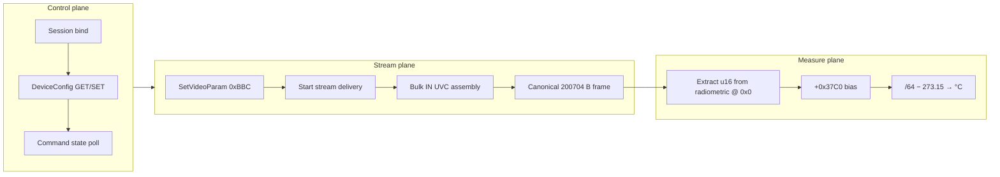

# 01 — Overview and architecture

## What is the Hik protocol?

TopDon TC002C-line thermal cameras expose a **UVC extension-unit control protocol** over USB. Configuration uses multi-phase control transfers; video arrives as **bulk IN UVC payload packets** that assemble into a **256×392 YUYV composite frame** containing a radiometric band, metadata footers, and a grayscale/LUT preview band.

All host communication is over USB:

- **Control plane:** USB control transfers (UVC-style SELECT + PROBE + GET/SET)
- **Stream plane:** USB bulk IN with UVC FID/EOF assembly (typically endpoint **0x81**)
- **Measure plane:** Host-side decode of YUYV-like LE16 temp pairs in the **radiometric** band @ **0x0**

---

## Protocol planes

### Control plane

Device configuration uses **DeviceConfig command IDs** (16-bit values like **0x7EF**). Each command maps to a typed struct. The host repacks full structs into compact **wire payloads** before issuing UVC control transfers.

Two command styles exist:

| Style | Used for | Example |
|-------|----------|---------|
| DeviceConfig GET/SET | Most parameters | Therm basic **0x7EF** |
| Control command | Immediate actions | Manual shutter **0x7E9** |

### Stream plane

Streaming is not plain UVC MJPEG. The host sets **video format code 0x67** via command **0xBBC**, arms bulk delivery, then assembles **~40** bulk IN transfers per frame. Decode contract is canonical **200,704-byte** composite; restart windows may emit jumbo wire payloads (primary **201,248**) that normalize into the same canonical frame.

The format descriptor uses width **8** and height **12578 (0x3122)** — protocol bookkeeping values, not pixel dimensions. The composite raster is **256×392** YUYV (**512 B/row**); the radiometric band inside it is **256×192**.

### Measure plane

Temperature readout is computed on the host from the **radiometric** band (**0x000000–0x017FFF**): YUYV-like macropixels with LE16 temp pairs. Environment parameters (emissivity, distance, ambient temperature, gain range) are sent to firmware via **0x7EF**; firmware applies radiometry before values appear in the stream grid.

---

## Device identity

| Property | Typical value |
|----------|---------------|
| USB vendor ID | **0x2BDF** (11231) |
| USB product ID | **0x0102** (258) |
| Extension unit wIndex | **0x0A00** (session-derived; obtain after bind) |
| Canonical frame payload size | **200,704** bytes (0x31000) |
| Alternate jumbo wire payload | **201,248** bytes primary (nearby variants observed) |
| Composite raster | **256 × 392** YUYV |
| Radiometric band | **256 × 192** YUYV-like LE16 temp pairs @ **0x0** |
| Visible band | **256 × 192** grayscale YUYV @ **0x18800** |
| Frame rate | **25** fps |

Other product IDs may appear on sibling models; enumeration and bind behave the same when stream assembly yields canonical composite or recognized jumbo variants that normalize to canonical.

---

## Identifying this protocol

Use this documentation when:

- Assembled UVC frames are canonical **200,704** bytes, or recognized jumbo variants that normalize to canonical
- Thermometry and image params use DeviceConfig commands **0x7EE/0x7EF** on **wValue 0x0300**
- Extension unit **wIndex** is **0x0A00** (typical on TC002C Duo)

---

## Next steps

- Transport details: [02_USB_Transport.md](02_USB_Transport.md)
- Full boot sequence: [03_Session_Initialization.md](03_Session_Initialization.md)
- Frame layout and temperature math: [07_Frame_Format_And_Decode.md](07_Frame_Format_And_Decode.md)
