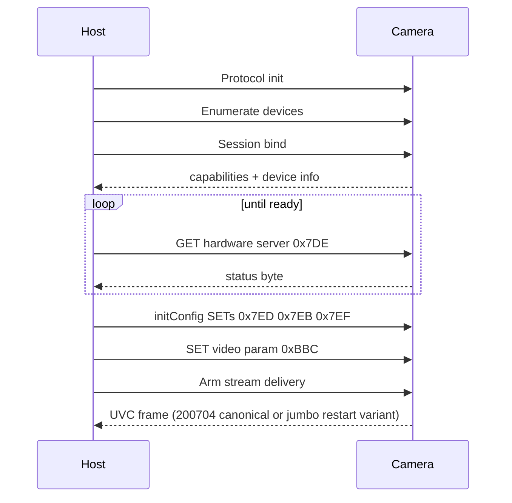

# 03 — Session initialization

Complete sequence from cold plug to first valid frame. Order matters; skipping steps or reordering SET bursts produces pinned defaults, timeouts, or zero-length bulk reads.

---

## Lifecycle overview



---

## Step 1 — Protocol initialization

Initialize host-side session state and USB access. Call once per process before enumeration or bind.

---

## Step 2 — Device discovery

Enumerate attached devices matching the target VID/PID. Collect the USB **string descriptor serial** (`iSerialNumber`) and bus path for multi-camera selection. This OS-visible serial is often a short suffix; the bind-time **0x7DB** block may also expose a longer manufacturing id (see [15_Device_Info_And_Identity](15_Device_Info_And_Identity.md)).

---

## Step 3 — Session bind

Bind a session handle to the chosen device. **Order matters.** Issuing GET **0x7DB** or GET **0x7DE** before the bind preamble returns a **2-byte stub** (`00 02`), not a parse error — the device is not in bind state yet.

### Cold-plug stub (unbound device)

| GET | Unbound response | Bound response |
|-----|------------------|----------------|
| **0x7DE** hardware server | **2 B** `00 02` | **3 B** (e.g. `01 02 02`) |
| **0x7DB** device info | **2 B** `00 02` | **488 B** struct |

**Bound-state gate:** treat the session as unbound when GET **0x7DE** returns fewer than **3** bytes or starts with `00 02`. Do **not** rely on PROBE **0x1700** u16 alone — cold plug often reports **512** (0x0200), which is misleading.

### Bind sequence (verified wire order)

Perform these steps on the extension unit (**wIndex** typically **0x0A00**) after claiming control/bulk interfaces:

1. **Extension arm** (optional but recommended on libusb hosts): PROBE/GET **0x0400** (version), SET **0x0500** with **`02 00`**, short GETs on **0x0600** / **0x0300** / **0x0100** — TopView Phase A pattern; see [02_USB_Transport](02_USB_Transport.md).
2. **Init capability bursts** (×**4** typical): direct PROBE **0x1700** → GET **5 B** → PROBE **0x1700** → GET **265 B** — **no SELECT**; equivalent to protocol-init / `USB_Init` window on the reference stack.
3. **Hardware server:** SELECT **(0x01, 0x04)** → GET **0x7DE** (**3 B** on wire).
4. **Device info:** SELECT **(0x01, 0x01)** → GET **0x7DB** (**488 B**) — firmware, **`bySerialNumber`**, `byDeviceID`, etc. (field map: [15](15_Device_Info_And_Identity.md)).
5. **Capabilities refresh:** SELECT **(0x17, 0x1D)** → PROBE **0x1700** → GET **5 B** → PROBE **0x1700** → GET **265 B**.

Optional identity GETs (**0x836**, **0x827**, **0x83D**) are **not** required for TC002C stream init. GET **0x836** succeeds after bind on direct libusb hosts even though the reference Android app does not call it at init.

Store the session handle for all subsequent commands.

### Multi-camera

Open each physical device by **USB string serial** or **bus + address** — never by “first matching VID/PID” when multiple units share a hub. Bind each session independently before GET **0x7DB** verification.

---

## Step 4 — Stream readiness gate

Before initConfig or stream start, poll hardware server status:

```
block = GET 0x7DE   // route phase (0x01, 0x04), wValue 0x0100
status = block[2]   // byDeviceInitialStatus
```

| status | Meaning |
|--------|---------|
| 0–1 | Initializing |
| **2** | Intermediate ready |
| **3** | **Ready to stream** |

Poll every **~150 ms** for up to **~30 s** until status is **2** or **3**. Do not SET video param **0xBBC** until this gate passes.

---

## Step 5 — initConfig (pre-stream configuration)

Three GET → modify → SET cycles. Each SET is followed by command-state poll.

### 5a — Image video adjust (0x7ED)

**Purpose:** Landscape orientation, corridor mode off, mirror state.

| Action | Detail |
|--------|--------|
| GET | **0x7EC** via route phase **(0x02, 0x06)**, wire read **31** B |
| PATCH | Enable active video path; clear corridor; set **256×192** landscape mapping |
| SET | **0x7ED**, wire **41** B |

### 5b — Image enhancement (0x7EB)

**Purpose:** White-hot palette, detail enhancement.

| Action | Detail |
|--------|--------|
| GET | **0x7EA**, route **(0x02, 0x05)**, wire read **79** B |
| PATCH | Force white-hot (**byte 1 = 0x02** in wire map), enable detail enhance |
| SET | **0x7EB**, wire **176** B |

### 5c — Thermometry basic param (0x7EF)

**Purpose:** Disable thermometry overlay on the encoded stream (firmware still embeds radiometric data in the composite frame radiometric band).

| Action | Detail |
|--------|--------|
| GET | **0x7EE**, route **(0x03, 0x01)**, wire read **80** B |
| PATCH | Set `byThermometryStreamOverlay = 1` (overlay off) if not already |
| SET | **0x7EF**, wire **80** B |

Optional defaults on first init:

| Field | Typical default | Encoding |
|-------|-----------------|----------|
| `dwEmissivity` | 95 | ×100 (0.95) |
| `dwDistance` | 100 | metres ×100 (1.00 m) |
| `byTemperatureRange` | 2 | 2=Normal, 3=High |

See [04_Thermometry_Parameters.md](04_Thermometry_Parameters.md).

---

## Step 6 — Video parameter (0xBBC)

Immediately before starting stream delivery:

```
SET 0xBBC  (USB_VIDEO_PARAM):
  dwVideoFormat  = 0x67      // thermal composite format
  dwWidth        = 8
  dwHeight       = 0x3122    // 12578 — format token, not pixel height
  dwFramerate    = 0x19      // 25 fps
```

GET id **0xBBB** / SET id **0xBBC**. Wire payload is compact (≤ **0xA8** B).

---

## Step 7 — Start stream delivery

Arm bulk frame delivery with stream type **0x67**. The host reads frames from bulk IN, classifies payload shape, and normalizes as needed:

| Field | Expected |
|-------|----------|
| Canonical payload | **200,704 (0x31000)** |
| Jumbo payload (restart artifact) | **201,248 (0x31220)** primary; nearby variants may appear |

Accept both recognized shapes. If jumbo is detected, normalize to canonical `200704` (map temp/yuv planes, zero-fill footer rows) before decode.

---

## Step 8 — Post-ready user settings (optional)

After the first valid frame, apply saved preferences:

| Order | Operation | Command | Fields touched |
|------:|-----------|---------|----------------|
| 1 | Temperature range | **0x7EE → 0x7EF** | `byTemperatureRange`, auto-range enable |
| 2 | Environment config | **0x7EE → 0x7EF** | emissivity, distance, ambient temp |
| 3 | Auto-shutter | **0x838** | serial cmd **0x2001** |
| 4 | Mirror / contrast / DDE | **0x7ED**, **0x7E5**, **0x7EB** | image params |

Poll command state between each SET.

---

## Timing guidelines

| Interval | Use |
|----------|-----|
| **150 ms** | Command-state poll loop |
| **250 ms** | Delay between back-to-back therm SETs |
| **30 s** | Maximum hardware-server wait |

---

## Failure modes

| Symptom | Likely cause |
|---------|--------------|
| GET **0x7DB** / **0x7DE** returns **2 B** `00 02` | Cold plug — bind preamble not run (see Step 3) |
| Hardware server never reaches 3 | Bind incomplete; wrong interface claimed |
| SET succeeds but reads pin old values | Missing command-state poll |
| Bulk read timeout | Video param not set; wrong endpoint; stream not armed |
| Assembled payload not canonical/jumbo | Incomplete or malformed UVC assembly; resync on FID/EOF; check USB bandwidth |
| Bulk read timeout before first EOF | Video param not set; stream not armed; increase timeout ≥ 8000 ms |

---

## Minimal pseudocode

```
protocol_init()
devices = enumerate_devices()
session = bind(devices[chosen])   # by serial; full preamble Step 3

while not hardware_server_ready(session):
    sleep(0.15)

get_modify_set(ROUTE_VIDEO_ADJUST, patch_landscape)
get_modify_set(ROUTE_IMAGE_ENHANCE, patch_white_hot)
get_modify_set(ROUTE_THERM_BASIC, patch_overlay_off_and_defaults)

set_video_param(format=0x67, width=8, height=0x3122, fps=25)
arm_stream_delivery(stream_type=0x67)

frame = uvc_assemble_bulk_in(ep=0x81)   # FID/EOF → canonical or jumbo wire payload
frame = normalize_if_jumbo(frame)       # output contract: 200704 B canonical composite
decode_temperature_grid(frame)          # radiometric band @ 0x0
```

See [11_Host_Implementation_Guide.md](11_Host_Implementation_Guide.md) for constants and decode helpers.

---

## Warm resume after soft pause

Cold init (this document) applies on **first bind** in a process and after **force-close / Logout**. It does **not** apply unchanged when the user backs out of thermal and returns with the camera still plugged.

Reference TopInfrared behavior (runtime trace Scenario B, 20260525):

| Layer | After soft pause + re-enter |
|-------|----------------------------|
| `USB_Init` / `USB_Login` | **Skipped** — SDK `userId` still valid |
| Bind preamble (Step 3) | **Repeated** — ~72 control transfers, same class as cold bind |
| Steps 4–6 (ready gate, initConfig, stream arm) | **Repeated** — triggered by `startStream()` + onReady `initConfig()` |

**Host rule:** unpause = **keep session handle, replay bind + initConfig + stream arm** — not “restart bulk reader only.”

Timing, Java lifecycle, detach vs pause, and force-stop/relaunch evidence: **[16_Pause_Resume_And_Lifecycle.md](16_Pause_Resume_And_Lifecycle.md)**.

---

## Force-stop relaunch (cold reconnect evidence)

Dynamic lifecycle observation (`20260527-194302-...-dynamic-lifecycle`) confirms the reconnect path after `am force-stop`:

1. Android kills existing process (`pid=15492`).
2. Relaunch starts a **new PID** (`pid=16414`).
3. New process performs `USB_Init Success!` then `USB_Login Success!` (VID `11231`, PID `258`).
4. UI returns to thermal streaming (`T6_RELAUNCH_STABLE` marker).

This validates that post-kill recovery is a **cold session rebuild** (same initialization class as Step 1 + Step 3 onward), not a warm in-process resume.
