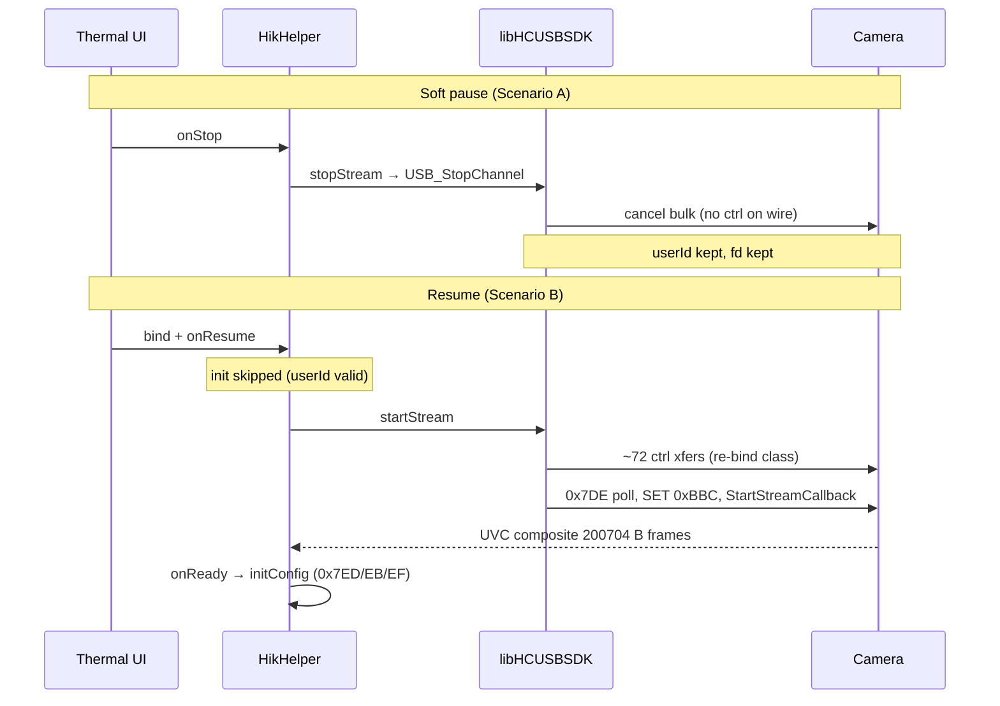

# 16 — Pause, resume, and host lifecycle

How the reference TopInfrared stack (TC002C Duo / `libHCUSBSDK`) stops streaming, keeps or drops session state, and starts again. Wire evidence from runtime trace Phase 5 (20260525); Java flow from reference implementation `HikHelper`.

**Related:** [03 Session initialization](03_Session_Initialization.md) (cold bind), [06 Video streaming](06_Video_Streaming.md) (start/stop bulk path).

---

## Scenario map (what was observationd)

| User action | runtime trace scenario | Observationd? | Session (`userId`) | Wire on stop | Wire on re-enter |
|-------------|----------------|-----------|--------------------|--------------|------------------|
| Back out of thermal UI (camera plugged) | **A** soft pause | Yes | **Kept** — no Logout | `StopChannel` only (~10 ms) | — |
| Re-enter thermal after back-out | **B** pause + resume | Yes | **Kept** | — | **~72 ctrl xfers** (full re-bind class) |
| Physical USB unplug while streaming | **C** detach | Yes | **Cleared** — Logout first | Logout/Cleanup; StopChannel **fails** later | Cold init on replug |
| Swipe app away / force-stop / process death | **D** dynamic lifecycle | **Yes** (20260527) | Process dies; new PID on relaunch | Existing process killed by AMS | Cold `USB_Init` + `USB_Login` observed |
| Explicit app Exit with camera plugged | — | **Partial** (Back-to-launcher path) | Session released in observation | `stopStream` → `StopChannel` → `release`/logout | Reopen path observationd |

Runner: teardown trace script (`-Scenario A|B|C`)

---

## Reference Java model

TopInfrared uses **`HikHelper`** lifecycle hooks, not a separate “unpause” API.

| Event | Code path |
|-------|-----------|
| First open thermal | `init()` → `USB_Init` + `USB_Login` → `bind()` → `onResume` → **`startStream()`** |
| Leave thermal (back) | `onStop` → **`stopStream()`** → `removeStreamCallback` → **`USB_StopChannel`** |
| Re-enter thermal | New thermal activity → **`bind()`** again → `onResume` → **`startStream()`** |
| USB unplug | `UsbDetachReceiver` → **`release()`** → `USB_Logout` + `USB_Cleanup` |
| Activity destroy | Clears frame listeners only — **no** `release()` |

Important details:

- **`init()`** is a no-op for USB when `userId != -1` (logs “重复调用”) — session survives soft pause.
- **`release()`** is **not** called on back navigation or normal activity destroy.
- **`TC02CDuoThermalActivity`** uses `bind(activity, isAutoStop=false)`; fragment paths still call `stopStream` on `onStop`.
- After stream is ready, UI runs **`initConfig()`** (0x7ED / 0x7EB / 0x7EF) plus contrast/enhance/auto-shutter — same coroutine runs on each ready callback.

Native stream start chain (1st and 2nd `startStream` — native inspection + reference implementation):

```
startStream()
  → checkCanStream     // poll GET 0x7DE until byDeviceInitialStatus ≥ 2
  → USB_SetVideoParam  // SET 0xBBC, format 0x67
  → USB_StartStreamCallback
```

See native start-stream chain notes.

---

## Soft pause (Scenario A)

**Trigger:** User taps Back from `TC02CDuoThermalActivity`; app returns to `MainActivity` (**process stays alive**).

### Call order (wire-confirmed, userId=247)

```
1. HikHelper.stopStream()
2. HikCmdUtil.removeStreamCallback(userId, callbackId)
3. JavaInterface.USB_StopChannel(userId, iHandle=0)   // ~3–9 ms, ret=1
```

### Not observed during stop window

| Item | Count |
|------|------:|
| `USB_Logout` / `USB_Cleanup` | 0 |
| `HikHelper.release()` | 0 |
| `LibusbControlTransfer` | 0 |
| UVC alt-0 / `releaseInterface` / `close` | 0 |
| Logged bulk IN | 0 (frames freeze; ~777 invokes then stop) |

Native stop (libuvc inside SDK): cancel async bulk transfers; drop in-flight buffers — **no pipe drain**, no DeviceConfig flush on stop.

Session: **`userId` valid**, USB fd and claimed interfaces **stay open** from the host’s perspective.

---

## Resume / unpause (Scenario B)

**Trigger:** Scenario A → hold ~12 s → automated re-navigation to thermal (no hub replug, no force-stop).

**Result:** `reopen_ok=true` — 200704 B composite frames resume without power-cycle.

### Java layer — warm session, not warm wire

| Step | Cold first open | Resume after soft pause |
|------|-----------------|-------------------------|
| `HikHelper.init()` / `USB_Init` | Yes | **No** (after pause; `userId` still valid) |
| `USB_Login` | Yes | **No** |
| `HikHelper.bind()` | Yes | **Yes** (count increments) |
| `HikHelper.startStream()` | Yes | **Yes** (~147 ms after bind in observation) |
| `HikHelper.release()` | No | **No** |
| `USB_Logout` | No | **No** |

Observationd counts (`20260525-143536-teardown-B`): `hikBind=3`, `hikStartStream=3`, `hikStopStream=2`, `hikRelease=0`, `USB_Logout=0`.

### Wire layer — near-full re-bind

Re-enter emits **~72 `LibusbControlTransfer` events** — same family as cold bind in `20260523-133829-hik-init`, **not** a minimal “resume bulk only” path:

- SELECT/GET bursts on **0x500**, **0x100**, **0x200**, **0x300**
- Capability PROBE/GET **0x1700** (5 B + 265 B)
- SET **0x118** (VS-style stream arm)
- GET **0x0600** command-state poll — **present on re-open**, **absent on stop**

Then `startStream` path: readiness poll **0x7DE**, SET **0xBBC**, stream callback registration, bulk resumes.

### Timing (Scenario B, single camera)

| Metric | Value |
|--------|------:|
| `stopStream` → `USB_StopChannel` | 0–1 ms |
| `USB_StopChannel` Java → native ret | 3–9 ms |
| Last frame before stop → `startStream` #2 (wall) | ~**36 s** (includes 12 s scripted hold + UI navigation) |
| `startStream` #2 → first 200704 B assembled frame | ~**1.2 s** |
| Control xfers on re-enter | ~**72** |

Do **not** assume a 500 ms settle alone is enough when the UI re-enters thermal — the reference app pays a **full control-plane re-bind** even though the SDK session handle was never logged out.



### Cold init vs warm resume (summary)

| Layer | Cold init | Warm resume (after soft pause) |
|-------|-----------|--------------------------------|
| Process | Fresh or post force-stop | **Same process** |
| `USB_Init` / `USB_Login` | Yes | **Skipped** |
| Bind preamble (~72 ctrl) | Yes | **Yes — repeated** |
| initConfig SET trio | Yes | **Yes** (on stream ready) |
| SET 0xBBC + arm | Yes | **Yes** |
| Alt-0 / release on pause | N/A | **No** on pause |

**Host takeaway:** Treat unpause as **“keep SDK session, replay bind + initConfig + stream arm.”** It is **not** “flip streaming bit and restart bulk reader only.”

---

## USB detach (Scenario C)

**Trigger:** Physical unplug while streaming (`20260525-144507-teardown-C`).

```
1. HikHelper.release()              // USB detach broadcast — T0
2. USB_Logout(userId)               // +0 ms, ret=1
3. USB_Cleanup()                    // +0 ms
4. HikHelper.stopStream()           // +~790 ms (activity onStop, after logout)
5. USB_StopChannel(userId=-1)       // ret=false — session already gone
```

Do **not** rely on `StopChannel` on hot-unplug — logout owns teardown. On graceful soft pause, order is the **opposite**: StopChannel **before** any logout.

---

## Force-stop and relaunch (Scenario D, observationd 20260527)

Dynamic lifecycle trace bundle: `20260527-194302-com.topdon.topInfrared-dynamic-lifecycle`

### What was observationd

- Full timeline markers (`T0..T6`) including force-stop and relaunch.
- App-process lifecycle from Android logcat.
- runtime trace teardown/reopen evidence through second exit (`T4`) and pre-kill window.

### Kill boundary (hard process death)

Logcat shows Android system force-stop and process kill:

```
19:44:46.927  Force stopping com.topdon.topInfrared appid=10264
19:44:46.929  Killing 15492:com.topdon.topInfrared/u0a264
```

This is not a graceful in-process teardown callback; AMS kills the process.

### Reconnect path after relaunch

On relaunch, a **new process PID** is created and USB session is rebuilt:

```
19:44:50.311  Start proc 16414:com.topdon.topInfrared/u0a264
19:44:52.231  [JavaInterface] USB_Init Success!
19:44:52.287  [JavaInterface] USB_Login Success! iUserID:248 dwVID:11231 dwPID:258
```

Timeline then reaches thermal streaming UI stable at `T6_RELAUNCH_STABLE` (~35 s from `T6_RELAUNCH_BEGIN` in this run).

### Practical interpretation

- Force-stop/relaunch is a **cold session path**: new process + `USB_Init` + `USB_Login`.
- It is materially different from Scenario B warm resume (same process, `USB_Init`/`USB_Login` skipped).
- Recovery into good camera state after kill occurs by rebuilding SDK session from scratch, then replaying bind/stream startup path.

### Remaining instrumentation gap

runtime trace attachment in this run ends at kill boundary (expected when target process dies), so per-call Java/native hook detail for post-kill bind/start sequence is not continuous in one hook log.

The reconnect conclusion is still strong from:
1. explicit process kill/new PID evidence, and
2. immediate `USB_Init` + `USB_Login` on relaunch.

For exact post-kill control-transfer enumeration in one correlated trace, rerun Scenario D with auto-reattach runtime trace after PID restart.

### Android-only auto-reattach follow-up (manual run, 20260527-222109)

Trace bundle: `20260527-222109-com.topdon.topInfrared-manual-run`

This run used **Android-only evidence** (runtime trace + logcat), no Windows USB host logs.

What it adds:

- runtime trace supervisor successfully reattached across process death (attempt `0696` then `0700`).
- In-process lifecycle is visible before and after process restart:
  - pre-kill process: PID `20093`, `USB_Init`/`USB_Login` with userIds `108`, `216`, `218`
  - post-kill process: PID `20656`, `USB_Init`/`USB_Login` with userId `246`
- Stop path remains consistent in-process:
  - `stopStream` → `removeStreamCallback` → `USB_StopChannel`
  - then `release` → `USB_Logout` → `USB_Cleanup` on exits where release runs

Relevant logcat boundary:

```
22:36:09.086  Killing 20093:com.topdon.topInfrared (remove task)
22:36:12.753  Start proc 20656:com.topdon.topInfrared
22:36:14.780  [JavaInterface] USB_Init Success!
22:36:14.843  [JavaInterface] USB_Login Success! iUserID:246
```

Interpretation:

- Even when kill is from task removal (not explicit `am force-stop`), reconnect is still a **cold process/session rebuild**.
- Auto-reattach works and confirms post-kill startup in the new PID.
- This run still did **not** emit `native.LibusbControlTransfer` events during the reattach window; app-level `USB_*` calls are definitive, but control-transfer enumeration is incomplete in this observation.

### Focused recipe run (manual, 20260528-045118)

Trace bundle: `20260528-045118-com.topdon.topInfrared-manual-run`

This run adds the missing control-transfer signal (`runtime_trace_native_ctrl_events: 72`) and clarifies where it occurs:

- Process `32687`:
  - initial stream comes up (`USB_Init`/`USB_Login`, `bind/startStream`)
  - Exit/re-enter (without process death) triggers a **72-transfer native control burst** and then `bind/startStream` again.
- Kill boundary:
  - task removal kills `32687`
  - supervisor reattaches to new process `1444`
  - new PID performs fresh `USB_Init` + `USB_Login` and reaches stable streaming.
- New PID (`1444`) did **not** emit a second visible control-transfer burst in observationd window; stream still stabilized.

Practical takeaway for reproduction:

- A "happy" recovery does **not** require immediate visible control-transfer storm on every post-kill relaunch.
- The reference remains reliable with:
  1. hard process reset (`kill/remove task`), then
  2. fresh `USB_Init` + `USB_Login`, then
  3. normal `bind/startStream`.
- The observed 72-transfer burst appears tied to in-process re-enter/startup preparation path (Scenario B-like), not strictly to process resurrection itself.

---

## Host implementation (QuadView / direct libusb)

Align lifecycle with reference **semantics**, not necessarily reference **timings** on multi-camera hubs.

### Soft pause (Compose back / preview dispose)

Match Scenario A intent:

1. Cancel async bulk; stop worker (short join — reference completes in ~10 ms single-cam).
2. **Do not** flush pipe, **do not** alt-0, **do not** release interfaces, **do not** close fd.
3. **Do not** call vendor Logout equivalent.

### Resume (re-acquire preview)

Match Scenario B intent:

1. Reuse open fd/claims when possible — **do not** call `claimForHik()` again if interfaces are already claimed.
2. Run **full bind preamble + initConfig + SET 0xBBC + arm** (`HikSession.runStartup()` or equivalent) — same wire class as cold init.
3. Allow **≥500 ms** after stop before hammering the hub; measured reference re-bind after UI nav is **much longer** when including navigation latency.

### Full exit (app Exit button)

Reference does **not** wire-observation Exit with camera still plugged (Scenario map: Unknown). **ThermalQuad (2026-05-25):** Exit, Compose back, and `onDestroy` all use the same **reference pause** as Scenario A — cancel bulk, keep fd + claims, no `closeHandle`, no Logout. Same-process relaunch is tested as Scenario B analogue. Legacy full close remains via recipe **E9** + `shutdownAll` for experiments only.

### Detach

Cancel best-effort → close fd; skip alt-0 on dead device. Reference uses Logout-first (Scenario C).

---

## Evidence sources

| Artifact | Content |
|----------|---------|
| Scenario A teardown notes | Soft pause recipe |
| Scenario B resume trace | Pause + resume (`reopen_ok=true`) |
| Scenario C detach trace | Detach ordering |
| Scenario D dynamic lifecycle timeline | Force-stop + relaunch timeline/logcat |
| Android-only auto-reattach follow-up | New PID + fresh USB init/login |
| Cold init ctrl-count notes | ~74 control transfers before first frame |
| Android handoff summary | Phase 5 summary |
| Native start-stream chain notes | Native startStream chain |
| `HikHelper.java` implementation notes | Lifecycle + `release()` |
